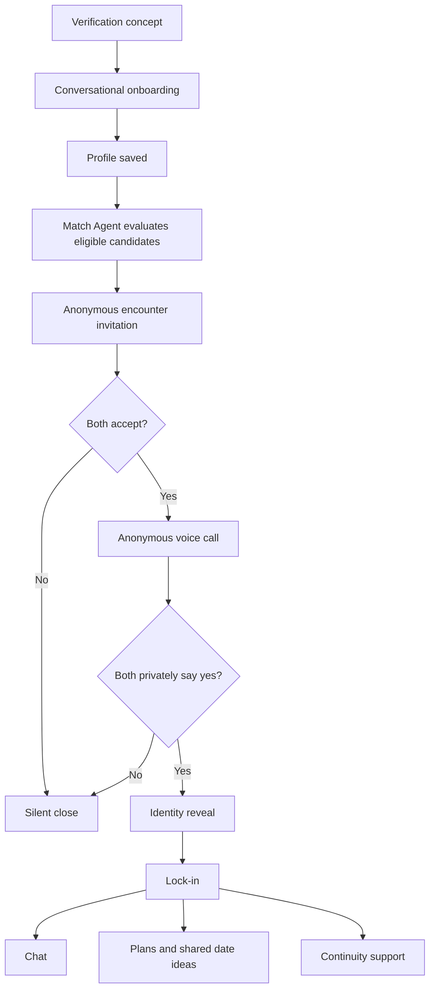
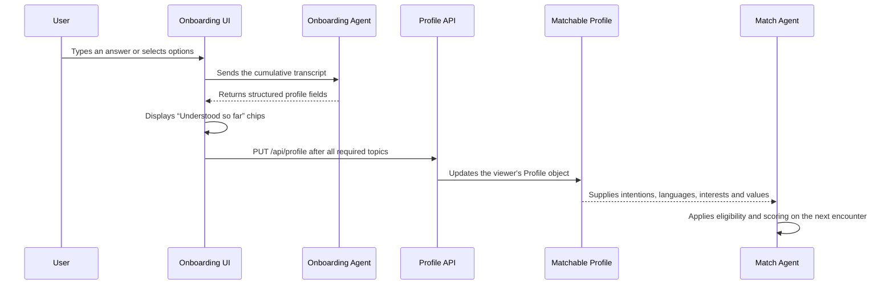

# Spark Project Handbook

> Complete technical and product overview of the `r2d2_simplifynext_agentic_ai_hackathon_2026` repository.  
> Last updated: 2 September 2026.

## 1. Executive summary

Spark is an agentic AI dating and social-connection prototype built for the SimplifyNext Agentic AI Hackathon 2026.

Its central experience is:

1. A person completes conversational onboarding.
2. Spark finds one compatible person whose path crossed theirs during a coarse time period.
3. Both receive an anonymous encounter invitation.
4. If both accept, they enter an anonymous voice call lasting no more than three minutes.
5. Each person privately decides whether to reveal their identity.
6. Identity is revealed only after two private yeses.
7. The connection becomes a lock-in that can use chat, planning, date suggestions and continuity support.

This is an agentic AI project because a LangGraph supervisor coordinates several specialised agents, tool calls, durable state, safety gates and follow-up actions across a multi-step workflow. However, safety-critical decisions such as consent and identity disclosure are intentionally handled by deterministic code rather than an AI model.

> [!IMPORTANT]
> This repository is a prototype. Its people, encounters and routines are synthetic. Singpass verification and telephony are simulated, and there is no production authentication or live location tracking.

## 2. Product principles

Spark is designed around intentional, limited connections rather than an infinite profile feed.

- One spontaneous encounter at a time.
- Anonymous interaction before appearance or identity.
- A hard three-minute maximum for the initial call.
- Mutual consent before revealing identity.
- Ten active lock-in spaces per user.
- No swiping or public profile browsing.
- Planning and conversation support after a mutual connection.
- No model-controlled consent, identity reveal or safety boundary.

## 3. Main user journey



## 4. System architecture

The project has two main applications:

| Area | Technology | Purpose |
| --- | --- | --- |
| `web/` | React, TypeScript, Vite, Tailwind CSS, Zustand | Mobile-style web application and offline demonstration |
| `spark/` | Python, FastAPI, LangGraph, Pydantic, MCP, OpenTelemetry | Agent orchestration, APIs, safety rules, simulation and evaluation |

The high-level runtime flow is:

```text
React screens
    |
    v
Adapter interface
    |-- MockAdapter: offline deterministic demonstration
    `-- HttpAdapter: FastAPI backend
                         |
                         v
                  LangGraph supervisor
                         |
              +----------+-----------+
              | specialised agents  |
              | deterministic gates |
              | MCP tools           |
              +---------------------+
```

The adapter boundary allows the same UI to run completely offline or against the backend by changing one environment setting.

## 5. Agents and their responsibilities

### 5.1 Supervisor

**Code:** `spark/src/graph/supervisor.py`

The Supervisor is the orchestration layer. It coordinates the encounter state machine, calls the appropriate nodes and pauses at consent gates using LangGraph `interrupt()`.

It controls this sequence:

```text
pool -> select -> notify -> accept gate -> call -> consent gate -> outcome -> lock-in
```

### 5.2 Onboarding Agent

**Code:** `spark/src/agents/onboarding.py`

The Onboarding Agent powers the profile chatbot. It processes the complete conversation and extracts:

- Connection intentions.
- Interests and hobbies.
- Personal characteristics.
- Values and what matters to the user.
- Languages.
- Lifestyle and availability when supplied.
- Matchable fields the person has consented to use.

Intent is never inferred from tone. A person must explicitly name what they are looking for.

When a language-model provider is available, the agent uses structured model extraction. If no provider is available, it falls back to deterministic extraction so the application remains usable.

### 5.3 Match Agent

**Code:** `spark/src/agents/match.py`

The Match Agent chooses one encounter candidate from the eligible overlap pool.

It uses:

- Shared connection intentions as a hard eligibility rule.
- Shared languages as a hard eligibility rule.
- Compatible availability.
- Shared interests and values.
- Coarse historical path crossings.
- Novelty against recent encounters.
- Distribution fairness so encounters do not concentrate on a small group.
- Blocks, cooldowns and available lock-in capacity.

The Match Agent estimates who may be worth a three-minute conversation. It does not claim to predict attraction.

### 5.4 Encounter Delivery

**Code:** `spark/src/agents/delivery.py`

Encounter Delivery manages the encounter transaction:

- Anonymous notifications.
- Two-party acceptance.
- Voice-bridge connection.
- Hard 180-second call limit.
- Private post-call consent.
- Identity reveal or silent closure.

This is deterministic application logic because an AI model must not control consent or identity exposure.

### 5.5 Continuity Agent

**Code:** `spark/src/agents/continuity.py`

The Continuity Agent manages longer-term support for up to ten active lock-ins.

It can:

- Retain grounded notes from previous conversations.
- Recognise when a connection becomes quiet.
- Suggest a concrete way to reconnect.
- Adjust to a user's preferred pace.
- Release inactive lock-ins gracefully.

The current Lock-ins UI intentionally does not display the earlier “Ask how it went” action or certification-exam reminder.

### 5.6 Communication Agent

**Code:** `spark/src/agents/communication.py`

The Communication Agent can suggest conversation prompts when a chat stalls. Suggestions must be grounded in something both people actually said. It suggests text but never sends messages on a user's behalf.

### 5.7 Date Agent

**Code:** `spark/src/agents/date.py`

The Date Agent produces three distinct date paths from shared interests and stated constraints. It ranks the shape of the date without receiving either person's location or overlap history.

The ranking is deterministic so plans remain explainable and repeatable.

### 5.8 Itinerary Agent

**Code:** `spark/src/agents/itinerary.py`

The Itinerary Agent turns a selected date path into a usable itinerary with:

- Named venues.
- Addresses.
- Arrival times.
- Walking legs.
- Estimated cost.
- A grounded reason for each stop.

It is separated from the Date Agent so no component possesses both a person's historical overlap location and venue coordinates.

### 5.9 Guardian

**Code:** `spark/src/agents/guardian.py`

Guardian is a deterministic safety feature that creates a discreet in-app interruption and private check-in. If someone reports that something felt wrong, the encounter is closed before an identity reveal can occur.

It does not imitate an operating-system warning and does not tell the other person why the encounter closed.

### 5.10 Trust and Safety

**Code:** `spark/src/safety/`

Trust and Safety is a cross-cutting deterministic guardrail layer. It screens onboarding text and post-reveal chat for harassment, sexual content, scams, profanity and attempts to bypass consent boundaries. It also handles blocks, reports and cooldowns.

## 6. Chatbot-to-profile-to-matching flow

The onboarding connection is now implemented end to end.



Important details:

- Every new answer is processed together with the earlier answers.
- Typed answers and selected buttons use the same extraction path.
- Users can select multiple options and press **Done** before advancing.
- The final result is saved only after all required topics are present.
- If saving fails, onboarding stops and displays **Try saving again**.
- Successfully saved profile chips are cached on the device for refresh restoration.
- In HTTP mode, the cache is revalidated against `GET /api/profile`.
- In offline mode, the cache is restored into the new in-memory `MockAdapter`, so the mock matcher uses it too.

The conversion between visible chips and backend profile fields is centralised in `web/src/api/profile.ts`.

## 7. Frontend screens

| Route | Screen | Current behaviour |
| --- | --- | --- |
| `/onboarding` | Onboarding | Singpass concept or foreigner signup, chatbot extraction, multi-select answers and profile saving |
| `/home` | Home | Spontaneous encounter status, encounter explanation and Telegram-inspired lock-in chat list |
| `/encounter` | Encounter | Anonymous encounter invitation |
| `/encounter/waiting` | Waiting | Waits for the other party after acceptance; no Home countdown timer |
| `/call` | Call | Anonymous call UI with a red **End call** button and hard maximum duration |
| `/call/consent` | Consent | Private yes/no decision |
| `/reveal` | Reveal | Displays identity only after mutual consent |
| `/lockins` | Lock-ins | Ten visible connection slots with chat and planning actions |
| `/lockins/:lockInId/chat` | Chat | Text, photo, voice and document controls with harmful-language masking |
| `/profile` | You | Editable profile, custom “Others” values and profile-photo control |
| `/plans` | Plans | Plans organised under each individual lock-in |
| `/plans/:lockInId` | Date Studio | Constraints, grounded plan generation, saving, rejection and refinement |
| `/plans/ideas` | Shared ideas | Common pool of proposed ideas, visible likes and invitation controls |
| `/plans/history` | Date history | Saved itinerary history |
| `/dates` | Dates | Compatibility route into the date-planning experience |
| `/admin/profiles` | Profile Lab | Demo-only synthetic profile management when demo mode is enabled |

### Home chat list

The Home screen presents every active lock-in in a familiar chat-list format while using Spark's blue-neutral palette. Each row can show:

- Profile avatar.
- Display name.
- Latest message or attachment type.
- Message time.
- Sent indicator.
- Unread count.
- Search filtering.

Selecting a row opens the corresponding lock-in conversation.

### Lock-ins

- Maximum active capacity: 10.
- Empty slots remain visible.
- Every active connection has chat and planning actions.
- The earlier follow-up reminder and “Ask how it went” button are removed.

### Plans

The Plans page groups saved plans and shared date ideas by lock-in person. Each person's section shows their avatar, saved-plan count, shared-idea count, plan history and a direct action to create another plan.

## 8. Profile data model

The matchable profile includes:

| Field | Purpose |
| --- | --- |
| `intents[]` | Hard compatibility requirement |
| `interests[]` | Shared-interest scoring and plan grounding |
| `values[]` | Permitted compatibility scoring |
| `personality` | User-stated characteristics |
| `lifestyle` | User-stated lifestyle information |
| `languages[]` | Hard shared-language eligibility |
| `availability_window[]` | Compatible encounter periods |
| `dealbreakers[]` | Deterministic eligibility exclusions |
| `age_band` | Broad age group rather than exact public age |

Height, body type, appearance-based filters and photographic matching are excluded by design. A post-reveal profile photo may be displayed, but it is not a matching feature.

## 9. Encounter state machine

The main encounter states are represented by validated schemas and checkpointed through LangGraph.

```text
PROFILED
  -> POOLED
  -> SELECTED
  -> NOTIFIED
  -> PENDING_ACCEPT
  -> CONNECTED
  -> CALL_ENDED
  -> PENDING_CONSENT
  -> REVEALED or CLOSED
  -> LOCKED_IN
  -> RELEASED
```

An unanswered invitation, declined invitation or failed voice connection enters a non-revealing terminal state. A non-mutual post-call decision closes the encounter without exposing which person declined.

## 10. MCP tool services

External capabilities are placed behind MCP tool boundaries.

| MCP service | Responsibility |
| --- | --- |
| `spark-overlap` | Historical coarse-cell and time-bucket overlap; no live position or distance API |
| `spark-profile` | Matchable profiles and scoped continuity notes without returning identity |
| `spark-voice` | Mock anonymous voice bridge with the hard call limit |
| `spark-calendar` | Coarse availability buckets |
| `spark-venue` | Date-option catalogue and interest-fit ranking inputs |
| `spark-sim` | Synthetic people, world state and evaluation arms |
| `spark-places` | Real OpenStreetMap venues, coordinates, hours and travel between selected stops |

Agent code reaches these services through `spark/src/mcp/registry.py`, which also records tool-call tracing and success metrics.

## 11. Safety invariants

These rules are enforced by ordinary code and tests, not model judgement:

1. No name, photo or contact number is exposed before both parties privately consent after the call.
2. A decline sends no observable signal identifying who declined.
3. Historical overlap locations, distance and coordinates are never rendered to users.
4. The initial call cannot exceed 180 seconds.
5. Consent events are append-only and are not turned into user-facing analytics.
6. No language model controls these boundaries.

Additional safety measures include:

- Text moderation for onboarding and post-reveal chat.
- Blocks, reports and cooldowns.
- Grounding rules for conversation prompts and date ideas.
- No live-proximity endpoint.
- Guardian closures that block later identity reveal.
- No fabricated venue fallback.

## 12. Storage and persistence

| Data | Current storage |
| --- | --- |
| Encounter graph checkpoints | SQLite checkpointer |
| Date Studio preferences and feedback | SQLite |
| Backend viewer profile | Current FastAPI session/world object |
| Completed web profile chips | Browser cache, revalidated against the adapter |
| Offline mock profile | In-memory adapter restored from the successful profile cache |
| Chat messages and shared-idea interaction UI | Zustand browser-session state |
| Uploaded profile photo | Browser-session state/data URL |

The profile used by the Match Agent is updated through `PUT /api/profile`. In the current no-authentication prototype, this is not yet a durable multi-user account database.

## 13. Current prototype limitations

The following distinctions are important when presenting or extending the project:

- There are no real user accounts or authentication sessions.
- Backend profile changes survive a browser refresh but not a backend world reset or process replacement.
- Singpass verification is a labelled simulation and collects no real Singpass credentials.
- Foreigner signup is a frontend prototype rather than a verified identity workflow.
- The voice bridge is simulated.
- There is no live location or live proximity tracking.
- Chat messages, attachments and moderation UI are not connected to a real-time two-party messaging backend.
- Shared date likes and invitations currently demonstrate the interaction locally; two authenticated parties are not yet connected in real time.
- Profile photos are not yet uploaded to durable object storage or delivered between authenticated accounts.
- AgentCore Runtime and AgentCore Memory are architectural targets, not live production integrations.
- OpenStreetMap venue data is fetched ahead of time rather than queried live.
- The Match Agent's recorded evaluation did not outperform random matching in the repository's pre-registered experiment.

## 14. Repository map

```text
.
|-- web/                       React web application
|   |-- src/screens/           Route-level screens
|   |-- src/components/        Reusable UI components
|   |-- src/api/               Adapter, HTTP, mock and profile conversion
|   |-- src/store/             Zustand application state
|   `-- src/__tests__/         Frontend behaviour and safety tests
|
|-- spark/                     Python agent system and API
|   |-- src/agents/            Specialised agents
|   |-- src/graph/             LangGraph supervisor, state and nodes
|   |-- src/api/               FastAPI routes and session runtime
|   |-- src/mcp/               MCP servers and tool registry
|   |-- src/safety/            Consent and guardrails
|   |-- src/schemas/           Pydantic domain and agent-output models
|   |-- src/memory/            Date-planning memory and reflections
|   |-- src/telemetry/         OpenTelemetry traces and metrics
|   |-- data/                  Synthetic people and venue data
|   |-- eval/                  Spark, random and similarity evaluation
|   `-- tests/                 Backend unit and integration tests
|
|-- docs/                      Architecture, frontend and pilot documentation
|-- lab/                       Original hackathon teaching exercises
|-- README.md                  Quick project introduction
`-- ARCHITECTURE.md            Detailed design and evaluation document
```

## 15. Running the project

### 15.1 Requirements

- Node.js and npm.
- Python 3.11 or newer.
- `uv` for Python dependency and environment management.

### 15.2 Offline web demonstration

The default configuration uses `MockAdapter` and does not need a backend or API key.

```bash
cd web
npm install
npm run dev
```

Open `http://localhost:5173`.

### 15.3 Web application with the FastAPI backend

Start the backend:

```bash
cd spark
uv sync
uv run -m src.api
```

Then start the web client in HTTP mode.

PowerShell:

```powershell
cd web
$env:VITE_API = "http"
npm run dev
```

Bash:

```bash
cd web
VITE_API=http npm run dev
```

The backend listens on `http://127.0.0.1:8000` and the web application normally runs on `http://localhost:5173`.

## 16. Testing and building

### Frontend

```bash
cd web
npm test
npm run build
```

The latest complete frontend verification passed **250 of 250 tests**, including typed onboarding persistence, refresh restoration, consent invariants, navigation, plans, chat and lock-ins.

### Backend

```bash
cd spark
uv run --with pytest pytest
```

For the core consent rules:

```bash
uv run --with pytest pytest tests/test_consent.py -v
```

The latest focused verification for the profile-to-Match-Agent connection, intent rules and agent behaviour passed.

## 17. Important implementation files

| Purpose | File |
| --- | --- |
| Route map and app-level profile restoration | `web/src/App.tsx` |
| Chatbot and onboarding persistence | `web/src/screens/Onboarding.tsx` |
| Chip/profile conversion and refresh cache | `web/src/api/profile.ts` |
| Editable You profile | `web/src/screens/Profile.tsx` |
| Home encounter state and chat list | `web/src/screens/Home.tsx` |
| Ten lock-in slots | `web/src/screens/LockIns.tsx` |
| Plans grouped by person | `web/src/screens/Plans.tsx` |
| Post-reveal chat | `web/src/screens/Chat.tsx` |
| Shared date ideas and invitations | `web/src/screens/SharedDateIdeas.tsx` |
| Adapter selection | `web/src/api/adapter.ts` |
| Offline implementation | `web/src/api/mock.ts` |
| HTTP implementation | `web/src/api/http.ts` |
| Onboarding extraction agent | `spark/src/agents/onboarding.py` |
| Matching agent | `spark/src/agents/match.py` |
| Encounter supervisor | `spark/src/graph/supervisor.py` |
| Profile and other HTTP endpoints | `spark/src/api/app.py` |
| Core user/profile schemas | `spark/src/schemas/core.py` |
| Consent ledger and reveal rules | `spark/src/safety/consent.py` |
| Text and output guardrails | `spark/src/safety/guardrails.py` |

## 18. Recommended next production steps

1. Add real authentication and assign every profile to an authenticated account.
2. Move durable profiles, chats, invitations and lock-ins into a production database.
3. Store profile photos and chat attachments in protected object storage.
4. Add two-party real-time messaging and invitation delivery.
5. Add server-side message moderation, attachment scanning and reporting workflows.
6. Replace simulated verification and telephony only after privacy and security review.
7. Add account deletion, retention controls and privacy-export workflows.
8. Conduct user interviews and a safety assessment before any real-world pilot.
9. Run the complete evaluation on the intended hosted model provider and report results without tuning them after the fact.

## 19. Summary

Spark combines a conversational Onboarding Agent, a fairness-aware Match Agent, deterministic consent gates and longer-term connection support in one coordinated system. The current application demonstrates the full journey from onboarding through matching, anonymous calling, mutual reveal, lock-ins, chat and planning.

The architecture is deliberately hybrid: models interpret and recommend, while deterministic code owns consent, identity, call limits, safety closures and data boundaries. That separation is the project's most important technical and product decision.
